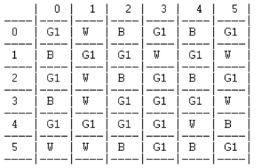
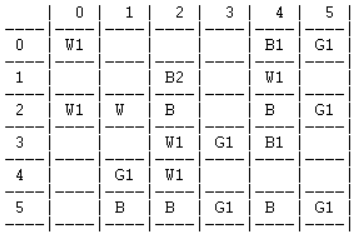
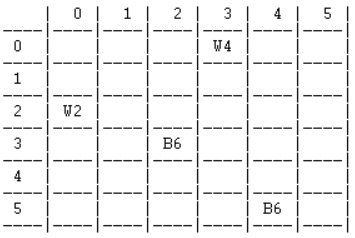

# PLOG 2020/2021

## Group T4G04
| Name             | Number    | E-Mail             |
| ---------------- | --------- | ------------------ |
| Pedro Coelho     | 201806802 | up201806802@fe.up.pt                |
| Tomás Mendes     | 201806522 | up201806522@fe.up.pt           |

## Instalation and Execution

To run **Greener** follow the next steps:
	
 - Install and run SICStus Prolog;
 - Go to **File** > **Working Directory** and navigate to the _src_ folder where you downloaded the code;
 - Go to **File** > **Consult** and select the file ***proj***;
 - Type `play.` into the SICStus console and the game will start.

## Greener

**Greener** is the second game of the *GreenGreenerGreenest*. *Green*, *Greener* and *Greanest* are three games that use the same set of components.

_Greener_ is a capturing game for 2 players, where both must capture the same colour.

**Basic Board**: a 6×6 board, 9 black pyramids, 18 green pyramids, 9 white pyramids.

**Gameplay overview**:

 - **Preparation**:

	The board starts full of pyramids. Each player has an allocated colour (Black or White) and green is a neutral colour.

 - **Starting**:

	Black starts. Players alternate turns during the game until both players pass in succession. On your turn, you must make one capture  if possible. Otherwise, you pass the turn. 

 - **Development**:
 
	Stacks capture other stacks that are on the same row or column and with no other stacks in between them, by stacking on top of them. This way, stacks cannot be split. 

 - **End**:
 
	 The game ends when all players pass in succession.
	 
 - **Objective**:

	The player with the most green pyramids captured (being part of stacks they control) wins the game. In case of a tie, the player with the highest stack wins. If the tie persists, play again.

[Official](https://boardgamegeek.com/boardgame/226081/greener) [Rules](https://nestorgames.com/rulebooks/GREENGREENERGREENEST_EN.pdf)

## Game Logic

## Internal representation of the GameState

### Board 
As a way of representing the board, we use lists within a list.
The game allows stacking pieces, so we decided to make the first argument of each cell the colour of the piece on top of the stack and the rest of the list represents the elements that are in that specific stack.   
Furthermore, after a move, when a cell doesn't contain any content, we will put a list with a string called empty and a 0.

#### Initial Situation

````
initialBoard([

[[green,1], [white,0], [black,0], [green,1], [black,0], [green,1]],

[[black,0], [green,1], [green,1], [white,0], [green,1], [white,0]],

[[green,1], [white,0], [black,0], [green,1], [black,0], [green,1]],

[[black,0], [white,0], [green,1], [green,1], [green,1], [white,0]],

[[green,1], [green,1], [green,1], [green,1], [white,0], [black,0]],

[[white,0], [white,0], [black,0], [green,1], [black,0], [green,1]]

]).
````

##### Initial Situation From Sicstus

 
#### Intermediate Situation
````
midgameBoard([

[[white, 0, green,1], [empty,0], [empty,0], [empty,0], [black,0, white, 0, green, 1], [green,1]],

[[empty,0], [empty,0], [black,0,green,1,green,1], [empty,0], [white,0,green,1], [empty,0]],

[[white,0,green,1], [white,0], [black,0], [empty,0], [black,0], [green,1]],

[[empty,0], [empty,0], [white,0,green,1], [green,1], [black,0,green,1], [empty,0]],

[[empty,0], [green,1], [white,0,green,1], [empty,0], [empty,0], [empty,0]],

[[empty,0], [black,0,white,0], [black,0], [green,1], [black,0], [green,1]]

]).
````
 
##### Intermediate Situation From Sicstus



#### Final Situation

````
endgameBoard([

[[empty,0], [empty,0], [empty,0], [white, 0,black,0,green,1,black,0,green,1,green,1,green,1], [empty,0], [empty,0]],

[[empty,0], [empty,0], [empty,0], [empty,0], [empty,0], [empty,0]],

[[white, 0,black,0, black,0,green,1,green,1], [empty,0], [empty,0], [empty,0], [empty,0], [empty,0]],

[[empty,0], [empty,0], [black,0,green,1,green,1,white,0,white,0,green,1,green,1,green,1,green,1], [empty,0], [empty,0], [empty,0]],

[[empty,0], [empty,0], [empty,0], [empty,0], [empty,0], [empty,0]],

[[empty,0], [empty,0], [empty,0], [empty,0], [black,0,green,1,green,1,white,0, white,0,green,1,green,1,green,1,green,1], [empty,0]]

]).
````

##### Final Situation From Sicstus
   

## GameState Visualization
For an intuitive visualization, we used **W**, **B**, **G** and " " to represent white, black, green and empty, respectively. Next to the symbol on top of the stack is the number of points or, in other words, the number of green pieces in the stack.

This way, we made a predicate called ````symbol(Piece, Symbol)```` to convert  our values when they are being printed out.

In order to print the board, we use mainly four predicates: ````printBoard(Board)````, that prints the columns' indexes and then calls the second predicate; ````printLines(Board, ColumnNumber)````, that recursively formats the line for the third predicate to fill; finally, ````printLinesAux(BoardLine)````, that prints the entire line by calling ````printCell(BoardLineHead)```` which prints the content of each cell in a user friendly manner.

## List of Valid Moves

In order to get the list of possible moves given the current game state and player, we implemented `valid_moves(GameState, Player,ListOfMoves)`. This way, this predicate uses **findall** and checks all the possible moves (````checkMoves(GameState, Player,X,Y,X1,Y1)````), making a list of lists that include the first and second pieces coordinates (**X**, **Y** and **X1**, **Y1**, respectively). In this sense, when the predicate **checkMoves** is called, we verify the closest pieces in each direction. So, given the first piece selected (player piece), the predicate checks if there's a move vertically (````checkUpPieces(GameState, Player, MoveCol, MoveRow, AuxRow)```` and ````checkDownPieces(GameState, Player, MoveCol, MoveRow, AuxRow)````) and horizontally (````checkLeftPieces(GameState, Player, MoveCol, MoveRow, AuxCol)```` and ````checkRightPieces(GameState, Player, MoveCol, MoveRow, AuxCol)````).   
 Finally, we store all moves processed in **ListOfMoves**.

## Move Execution

Move execution is handled by the predicate ````move(GameState, Player, MoveDoneGameState)````. Since a move can be divided in two parts - selecting a stack to move and selecting a stack to capture -, this calls are made by two other predicates: ````readFirstInput(Col, Row, ConfirmedCol, ConfirmedRow, Player, GameState)```` and ````validateSecondInput(SelectCol, SelectRow, MoveCol, MoveRow, Player, GameState)````.
So, the first one checks the first input, reading the column and row selected and confirming if the selected piece belongs to the player that is making a move (````validateFirstPiece(GameState, Player, Row, Col)````). 
On the other hand, the second predicate verifies if the stack that is being captured represents a valid move. This way, ````checkMoves(GameState, Player, SelectCol, SelectRow, MoveCol, MoveRow)```` is called in order to check if the selected piece and target location have no pieces between them and if they are in the same column or row. 
Finally, ````movePiece(GameState, ConfirmedCol, ConfirmedRow, ConfirmedMoveCol, ConfirmedMoveRow, MoveDoneGameState)```` receives and processes the already validated move, updating the game state. In other words, the first cell selected will turn into an empty cell and the second one will have the content of the first added on top of the stack.  


## End Game

Firstly, to check if the game is over, we check if there is any move left for the player to make, using ````contentAnyFound(Col, Row, Player, GameState)````. This predicate verifies if there's any piece from the current player that has a valid move. If it doesn't succeed,
a flag is triggered by the variable **Check1**. Then, in case the other player doesn't have available moves, we verify if **Check1** was turned on and, if this is true, ````game_over(GameState, Winner)````is called, verifying who the winner is (the player that has the most points). Finally, ````congratulations(Winner)```` prints that the match has ended and congratulates the player that won.

## Board Evaluation

The board evaluation is made by ````value(GameState, Player, BoardPoints)````. This way, this predicate iterates each line, counting all green pieces collected by the given player. Finally, when the board has been completely iterated through, points are stored in **BoardPoints**.
Furthermore, this value is used when the predicate ````iterationPrint(GameState)```` is called, in order to display the points of each player. 


## Computer Move

The computer move is handled by the predicate ````choose_move(GameState, Player, Level, Move)````. Depending on the value of the varaible **Level**, there are two ways a computer can choose a move:
 - If **Level** is 1, the computer chooses a random move from a list with all the valid moves. Firstly, ````valid_moves(GameState, Player, ListOfMoves)```` is called, storing all the moves available in **ListOfMoves**. Then, a random move is choosed and processed in ````botTestMove(GameState, Move, NextGameState)````.
 - If **Level** is 2, the computer analyzes all the possible boards built after his move, choosing the board that maximizes his points. This way, after processing all moves, he will check what move suits him best in a way that will bring him the maximum points he can possibly get in that move. So, ````bestMove(GameState, ListOfMoves, BestMove, Player)```` is called, using **setof** to organize all elements by the value that the computer has after that move. Then, the list is reversed since it was in increasing order and, finally, the first move (the one that represents the maximum points) is picked and processed in ````botTestMove(GameState, Move, NextGameState)````.

## Conclusions

Prolog was a new language for us that was only introduced in this course, so we had difficulties starting the project. In the beginning, our workflow was slow since our knowledge and comprehension about programming in a recursive way wasn't the best. However, as we moved forward, we overcame some barriers and started to understand how the logic of Prolog works.
Furthermore, there are no known issues, bugs or limitations that we've encountered and we find the final result of this project to be very satisfactory.
For possible improvements, we could've added another difficulty to the computer, for example: one that analyzes the points multiple moves ahead of the current game state.

## Bibliography

 - Moodle slides;
 - [SICStus Prolog documentation](https://sicstus.sics.se/sicstus/docs/latest4/html/sicstus.html/);
 - [SWI Prolog documentation](https://www.swi-prolog.org/pldoc/doc_for?object=manual);

